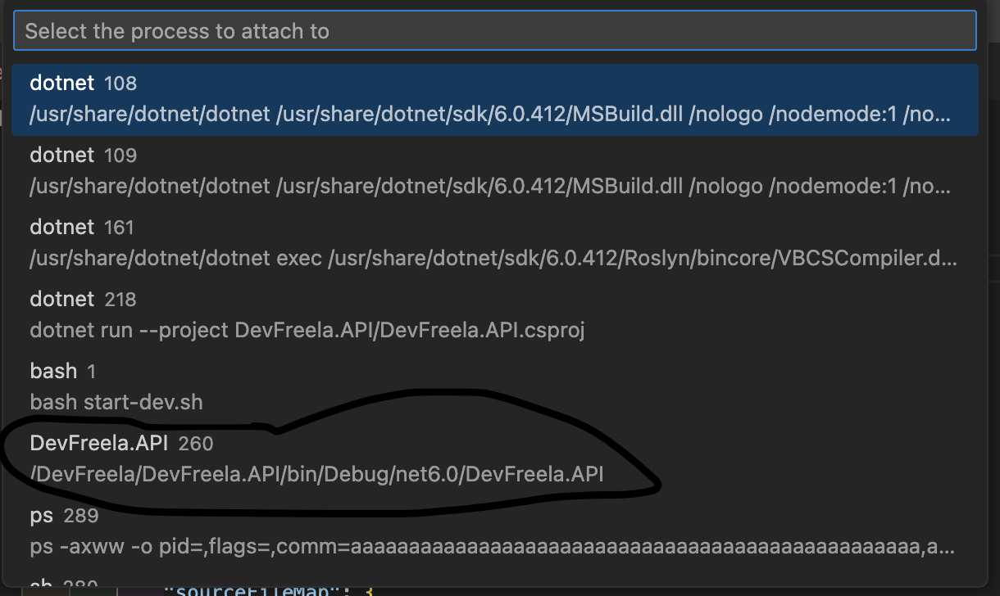

# Projeto DevFreela criado no curso Formação ASP.NET Core

Api de freelancers


## Getting Started

## Pré-requisitos

- Docker
- .NET SDK

## Executando a aplicação

crie a network do container usando o seguinte comando:

```
    docker network create dev-freela-net
```


inicie a aplicação

```
    docker-compose up
```

## Configuração de debug via docker

dentro da pasta .vscode/lauch.json coloque a seguinte configuração

```
{
    "version": "0.2.0",
    "configurations": [
        {
            "name": ".NET Core Docker Attach",
            "type": "coreclr",
            "request": "attach",
            "processId": "${command:pickRemoteProcess}",
            "pipeTransport": {
                "pipeCwd": "${workspaceRoot}",
                "pipeProgram": "docker",
                "pipeArgs": [ "exec", "-i", "devfreela-api-1" ],
                "debuggerPath": "/root/vsdbg/vsdbg",
                "quoteArgs": false
            },
            "sourceFileMap": {
                "/DevFreela": "${workspaceRoot}"
            }
        }
    ]
}

```

depois que a aplicação subir é necessario selecionar o processo correto para vincular seu debug ao container, como é mostrado na imagem a seguir

